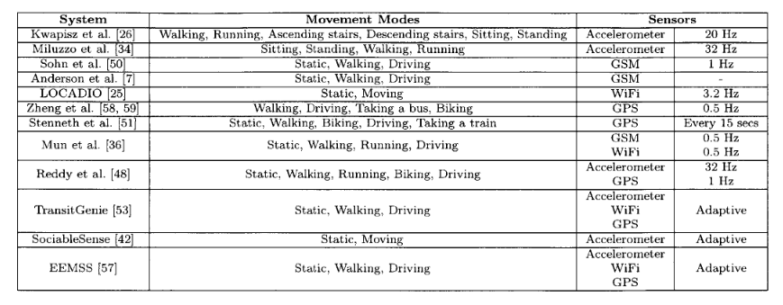
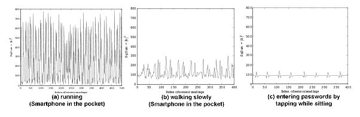
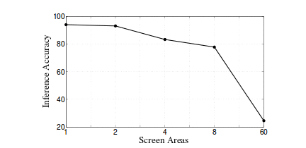

Relevent Information From Previous Work
=======================================

	[Yu]_ Features of some systems in activity detection using mobile devices. Note, most of these systems use additional external accelerometers.

In [Yau]_ [Yau1]_ and [Narseo]_, The authors explain how context aware applications play an important role in health administration, advertisements, improved user interfaces, and even advanced power management systems in phones. In particular, [Narseo]_ gives detailed overview on current methods of context awareness using Bluetooth, WiFi, GSM, and other wireless technologies. [Krum]_ gives an example where accelerometer information is combined with WiFi signal strenght indicators to estimate location and motion vectors.

The most detailed information, however, comes from [Xu]_ [Owusu]_ and [Aviv]_. Taplogger ([Xu]_) used the square of the L-2 Norm to distinguish tap events from walking and running. I tried recreating the results from :ref:`context-label` however, the *walking slowly* context really meant barely moving, and the *typing while sitting* context meant the phone was on the table while tapping the phone. Xu et al did give clever insight into what could constitute *contextual state*, which will help me when I design my HMMs. 

Owusu et al, extend the work in [Xu]_ by experimenting with a larger set of feature selection criterea. I will take a look at how Cal performs given various feature selection criterea. They then used a Random Forest (RBF) support vector machine as their classifier. They suspect that Random Forests performed well because of the propensity for significant variability of feature values between instances of the same label. Although they had fairly poor results in the final password inference (probably due to the high granularity), they did provide a nice graph shown in :ref:`inference-accuracy`. It should be noted, that we can determine a key press in a 8-partition screen with about 80% accuracy.

Unlike Owusu and Xu, Aviv takes a more formal signal processing approach to password inference using accelerometers. They differentiate statistical methods of feature extraction from short-sample Fourier polynomial methods. Aviv also explores multiple data normalization methods (Mean normalization, Linear Normalization, and Quadratic Normalization) and uses a simple windowing technique to sew sample bins together. They continue by construction a Hidden Markov Model, accounting for 
label trends, human and device effects, and movement noise.

.. _context-label:

	Acceleration readings in different contexts [Xu]_

.. _inference-accuracy:

	Inference accuracy by screen region granularity. The screen surface is partitioned into successively smaller blocks and evaluated for classification accuracy
