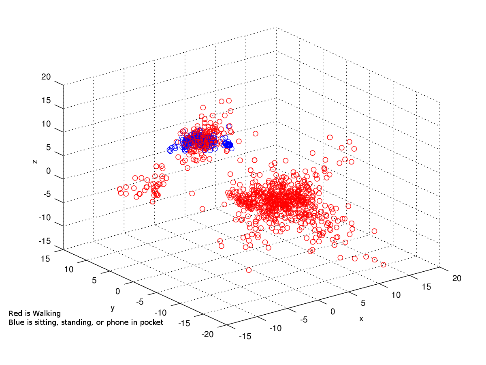
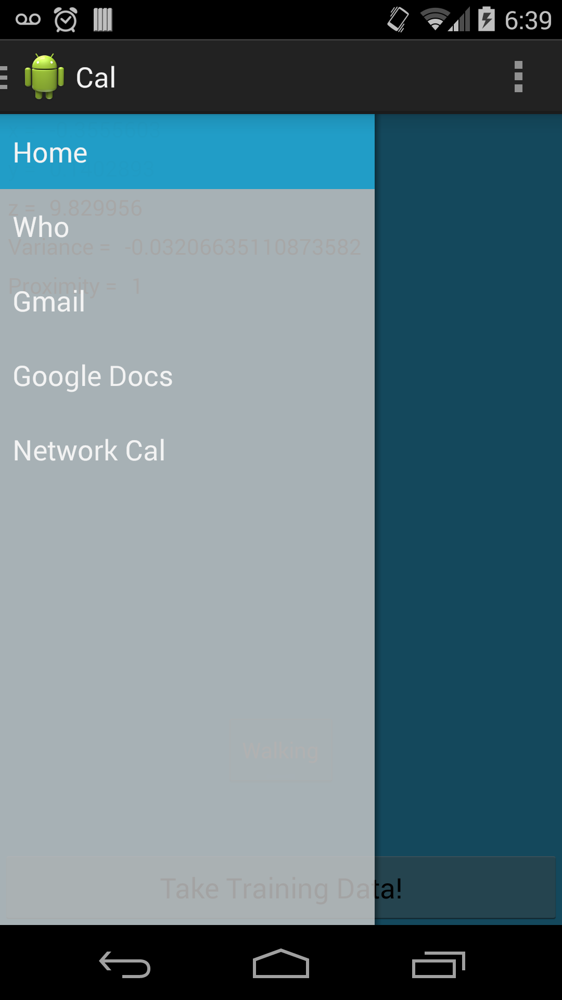
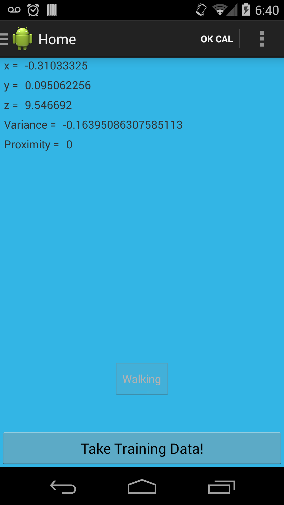
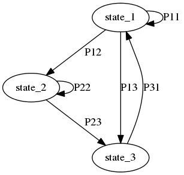

Inital Experiments
==================

.. figure:: images/pocketTest2_1.png
	
	First experiment with phone accelerometer. I was sitting at my desk for a bout ten minutes, walked to class, waited for about 5 minutes, went and got a snack, then returned to class. Notice how the transitions between states are noisy.

.. _pocket-call:

.. figure:: images/pocketCall.png

	Here, I added a proximity sensor to the sensor manager. The first burst of spikes was me playing with the sensor. The second burst was me putting my phone in my pocket. The last group of spikes was me actually answering a phone call (my phone battery died shortly after that). A state value of 1 represents walking, 0 means phone was in my lap or I was playing with it at my desk.

	3D Scatter plot of accelerometer data (same data samples as previous plot with proximity sensor). Notice the tight cluster of blue? This is where I was playing with my phone at my desk. One red cluster is where my phone is in my pocket, the other is where I was talking on the phone.

	Initial concept of Cal App. 

	Initial version of Sensor Debug screen.

.. figure:: images/screen2.png

	Adding custom voice commands is actually easier than expected. This will work out well since Cal is dependent on a network connection.

Some Expected Graphs
--------------------

	Placeholder Hidden Markov Model state machine. Will determine the actual model later.

.. figure:: images/graphs/hmm_tree.png

	I expect that we might be able to classify different behavior patterns into a decision tree (may be in a calibration step). This way I can get improved performance on my different ML methods.

